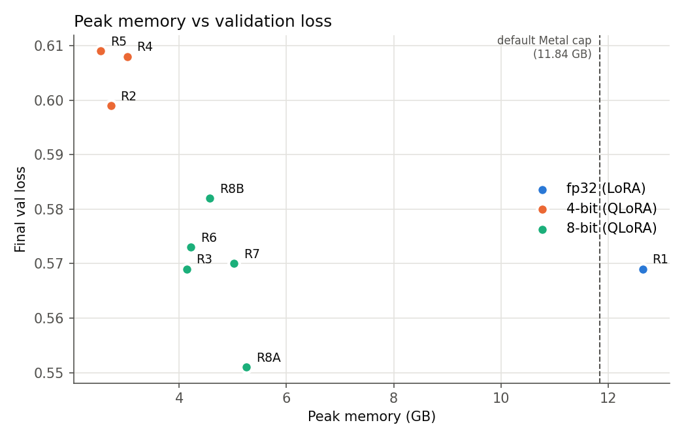
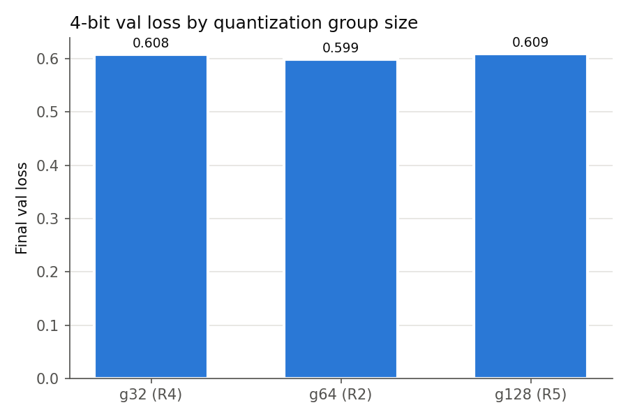
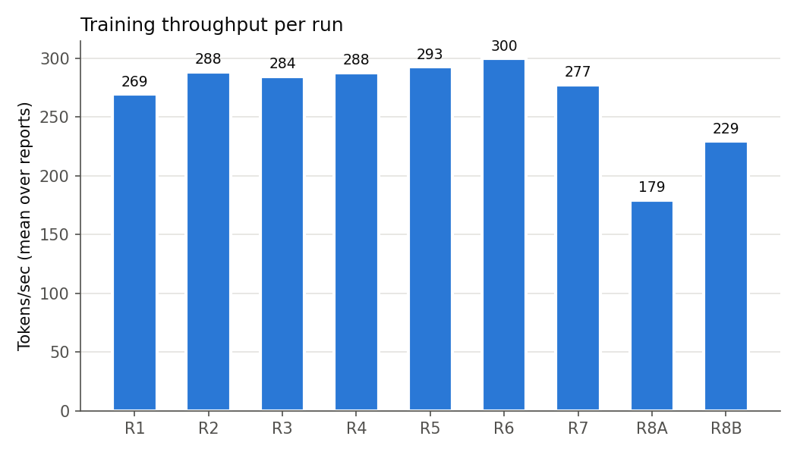
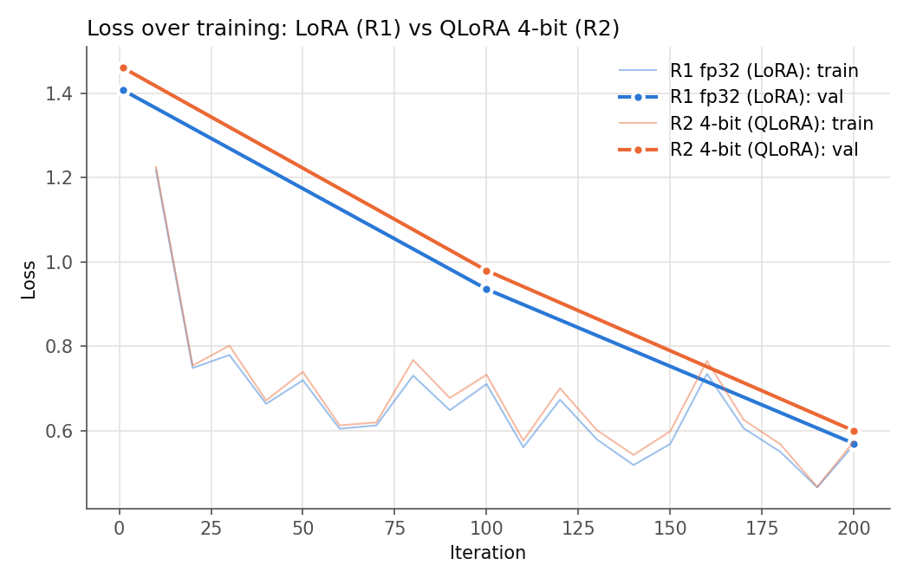

# LoRA vs QLoRA on Apple Silicon: memory/quality tradeoffs in MLX

This is a controlled companion experiment to [ml-experiment](https://github.com/Melmonster13/ml-experiment). It replays the best StarCoder2-3B LoRA run from that project, then retrains it on quantized base models ("QLoRA-style") in the same framework, on the same laptop, with the same data. Each run changes one variable.

The headline result: **an 8-bit base model cut peak training memory by 67% (12.64 → 4.14 GB) with identical val and test loss (0.569 / 0.595).** A 4-bit base cut memory by 78% (to 2.73 GB) and raised val loss by about 5%.

The freed memory made room for configs that ran out of memory in the original project. The 16-layer, 1024-token config that OOM'd at startup now trains in 5.25 GB. It also gives the best val loss (0.551) and test loss (0.561) of any run.



## Setup

- **Hardware:** M4 MacBook Pro, 16 GB unified memory
- **Software:** Python 3.11, mlx 0.31.2, mlx-lm 0.31.3
- **Model:** `bigcode/starcoder2-3b`. The HF checkpoint stores weights in **fp32**, so the baseline is an fp32 base model.
- **Data:** `iamtarun/python_code_instructions_18k_alpaca` in Alpaca prompt format. Train/valid/test split is 16,752 / 930 / 930. The files are byte-identical to the original project's (see [docs/baseline.md](docs/baseline.md) for checksums).
- **GPU memory cap:** raised from the default 11.84 GB to 14 GB (`sudo sysctl iogpu.wired_limit_mb=14336`) for **every** run. The fp32 baseline peaks at 12.64 GB, over the default cap. Without the raise it ran out of memory twice before completing (see [R1 reproducibility](#r1-reproducibility)).

## Method

- **Baseline hyperparameters**, taken from the original run `2026-05-04-2233`:
  - LoRA rank 8, scale 10, dropout 0.05
  - Targets: `q/k/v_proj` and `dense` in the last 4 layers
  - Adam, learning rate 1e-4 (constant), batch size 1
  - 200 iterations, sequence length 256, gradient checkpointing on, seed 0
- **Quantized bases** were built once with `mlx_lm convert -q` (affine quantization, fp32 scales and biases) and reused across runs.
- **One variable per run** relative to the baseline, or relative to R3 for R6–R8. Every config is in [`configs/`](configs/).
- **Fresh process per run** ([`scripts/run.py`](scripts/run.py)), so peak memory never carries over between runs. The run script parses val loss, test loss, peak memory and tokens/sec from `mlx_lm lora` stdout and keeps the raw logs in [`results/logs/`](results/logs/).
- **Test loss** is computed on the full 930-example test set. Val loss uses `val_batches: 5` to match the original, so **test loss is the more reliable number.**

## Results

| Run | Base | Change | Peak mem (GB) | Val loss | Test loss | Tok/s | Min |
|---|---|---|---:|---:|---:|---:|---:|
| R1 | fp32 | baseline replay | 12.64 | 0.569 | 0.595 | 269 | 10.0 |
| R2 | 4-bit g64 | — | 2.73 | 0.599 | 0.614 | 288 | 8.7 |
| R3 | 8-bit g64 | — | 4.14 | 0.569 | 0.595 | 285 | 8.9 |
| R4 | 4-bit g32 | — | 3.04 | 0.608 | 0.609 | 288 | 8.8 |
| R5 | 4-bit g128 | — | 2.54 | 0.609 | 0.616 | 293 | 8.6 |
| R6 | 8-bit g64 | grad checkpointing off | 4.22 | 0.573 | 0.595 | 300 | 8.8 |
| R7 | 8-bit g64 | seq len 1024 | 5.03 | 0.570 | 0.593 | 277 | 11.0 |
| R8a | 8-bit g64 | 16 layers + seq 1024 (original OOM) | 5.25 | **0.551** | **0.561** | 179 | 12.1 |
| R8b | 8-bit g64 | 8 layers + seq 512 (original OOM) | 4.57 | 0.582 | 0.579 | 229 | 10.9 |

Source: [`results/runs.csv`](results/runs.csv). Tokens/sec is the mean over training reports.

**What the results show:**
- **8-bit matched fp32 quality.** R3 is not a copy of R1: its val loss at iteration 1 was 1.408, vs R1's 1.407. It still finished at the same val and test loss to three decimals.
- **4-bit cost about 5% val loss and 3% test loss.** For another 1.4 GB of savings over 8-bit, that's the only real quality tradeoff in the experiment.
- **Group size barely mattered at 4-bit.** The g32 / g64 / g128 spread is 0.010 on val loss and 0.007 on test loss, and the val and test rankings disagree. With 5 val examples, the ranking isn't meaningful.
- **Gradient checkpointing saved almost nothing at this scale.** Turning it off (R6) added 0.08 GB of peak memory and ran 5% faster. At 4 layers and 256 tokens, activations are a small share of memory next to the weights.
- **Training was slightly *faster* on quantized bases**, by 6–9% tokens/sec. That's the opposite of the common expectation. A likely factor is that the fp32 baseline reads 4× more weight bytes per step. It's reported as found, and it's specific to this hardware and baseline.





## R8: the redemption run

On 16 GB, the original project could only fit StarCoder2-3B at 4 LoRA layers and 256-token sequences. Both larger configs failed:
- 16 layers / 1024 tokens ran out of memory at startup.
- 8 layers / 512 tokens ran out of memory at iteration 1.

On the 8-bit base, both configs trained comfortably, at 5.25 GB and 4.57 GB. R8a gave the best result in the whole experiment: test loss 0.561, vs 0.595 for the baseline. The memory saved by quantization was worth more than the quality it cost.

## R1 reproducibility

R1 reproduced the original run exactly: val loss 1.407 / 0.935 / 0.569 at iterations 1 / 100 / 200, and train loss matched at every report. It took three attempts:
1. **Attempt 1:** ran out of memory at about iteration 55.
2. **Attempt 2:** ran out of memory before iteration 10, even with 30 GB of free disk.
3. **Attempt 3:** completed after the GPU memory cap was raised to 14 GB.

The fp32 baseline peaks at 12.64 GB, over Metal's default 11.84 GB cap on a 16 GB machine. Whether it completes depends on the state of memory at the time, so the original run completing was partly luck. The failed logs are kept in [`results/logs/`](results/logs/).

## Honest caveats

- **"QLoRA-style," not QLoRA.** MLX uses affine group-wise integer quantization, not the NF4 data type and double quantization from the QLoRA paper.
- **The baseline is fp32, not bf16.** The memory savings are measured against the checkpoint's native fp32 weights. Against a bf16 base, which roughly halves weight memory, the savings would be smaller.
- **R7 and R8 losses aren't strictly comparable to R1–R6.** Longer sequences keep tokens that the 256-token runs truncate, so the loss is computed over a different set of tokens.
- **Small validation set.** Val loss comes from 5 examples (inherited from the original). Test loss on 930 examples is the number to trust.
- **Single seed, single machine, single dataset, 200 iterations.** Differences of about 0.01 are within what seed variance could plausibly produce.

## Qualitative samples

[`scripts/eval_samples.py`](scripts/eval_samples.py) generates greedy completions (temperature 0, 256 max tokens, seed 0) for 10 fixed Python prompts ([`prompts/eval_prompts.txt`](prompts/eval_prompts.txt)) with each run's unfused adapter. Outputs are in [`results/samples/`](results/samples/).

## Reproduce

```bash
python3.11 -m venv .venv && source .venv/bin/activate
pip install -r requirements.txt
# data/: copy {train,valid,test}.jsonl from ml-experiment (see docs/baseline.md for checksums)
sudo sysctl iogpu.wired_limit_mb=14336   # resets on reboot
scripts/quantize.sh
scripts/run_all.sh                      # every config, one fresh process each
python scripts/eval_samples.py
python scripts/plot.py
```

## Project structure

```
configs/            one mlx_lm lora YAML per run
docs/baseline.md    extracted baseline, decisions, reproducibility notes
scripts/            quantize.sh, run.py, run_all.sh, eval_samples.py, plot.py
prompts/            fixed eval prompts
results/            runs.csv, raw logs, samples, plots
```

Model weights, adapters and data are gitignored.

## Possible follow-up

A CUDA comparison using PEFT and `bitsandbytes` NF4, to measure MLX affine 4-bit against true QLoRA.
